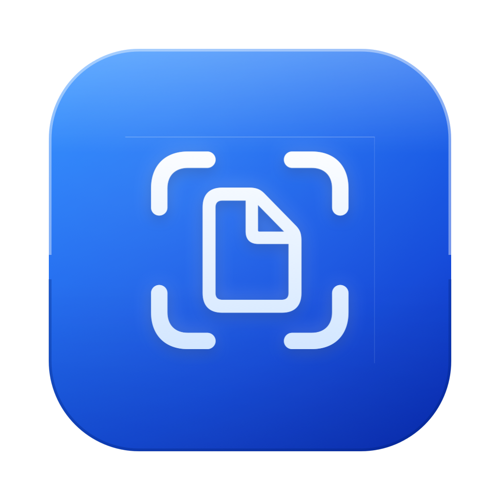
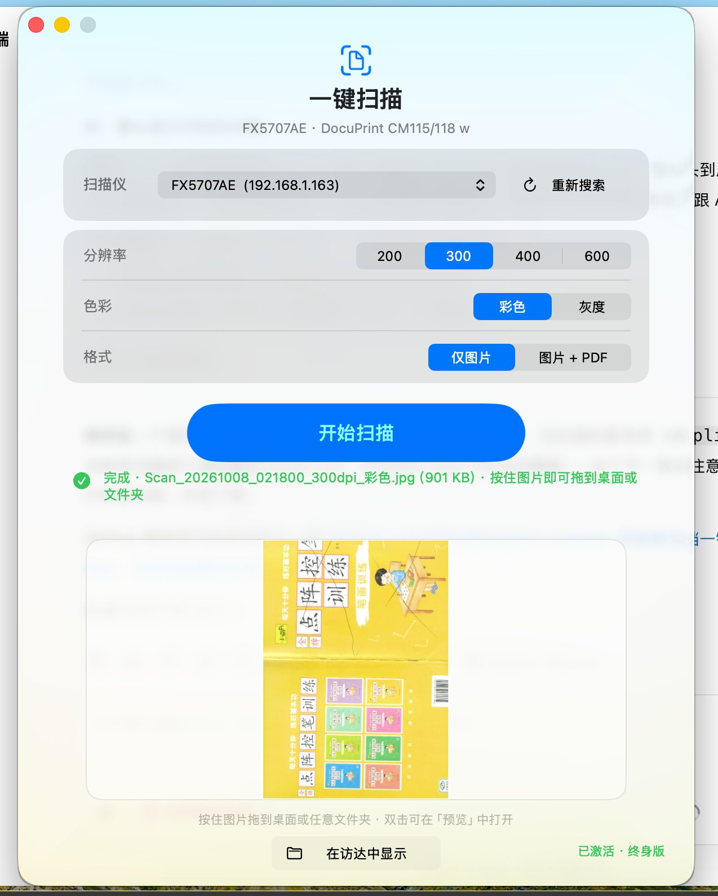
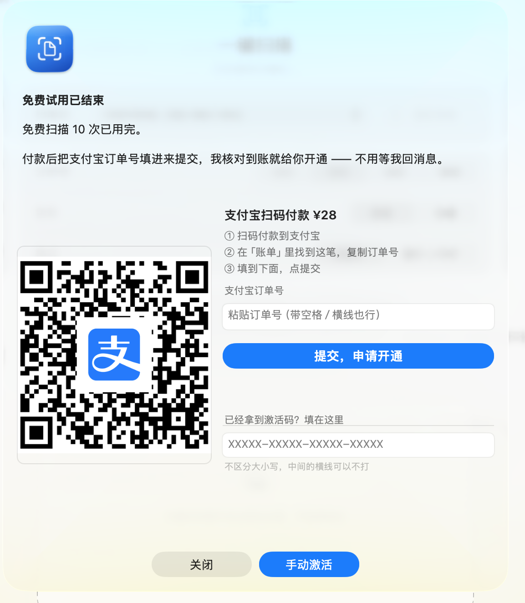

# 一键扫描 for Mac — 富士施乐 DocuPrint CM115/CM118 w 网络一体机扫描工具

**FUJI XEROX DocuPrint 在 Mac 上扫不出来？装这个就行。**

[为什么需要它](#-为什么需要它) · [下载安装](#-下载安装) · [使用说明](#-使用说明) · [授权](#-授权) · [FAQ](#-faq)

---

## 🎯 适用机型

**FUJI XEROX（富士施乐）DocuPrint CM115 / CM118 w** —— 这类 **WSD 网络多功能一体机 / 网络扫描仪**。

搜索关键词：DocuPrint 扫描 · 富士施乐扫描 · CM115 扫描 · CM118 扫描 · Mac 扫描仪驱动 · WSD 扫描 · 网络一体机扫描到 Mac

### 为什么 Mac 官方驱动扫不了

如果你用的是这台机器，想把它扫描到 Mac 上——

> **装 Apple 官方驱动是没用的。**

这类机器走 **WSD（Web Services on Devices）** 协议扫描，
**不支持 AirScan（eSCL）**，而 Mac 官方驱动早已停更、不再适配。
结果就是：机器能打印、能复印、能装驱动，就是**没法在 Mac 上扫描**。

**一键扫描**直接用设备自带的 **标准 WS-Scan 协议**驱动它，
**不依赖任何厂商驱动**——任何 Mac 装上就能用。

  

---

## 💡 它解决的是什么问题

装上之后，你的 DocuPrint 在 Mac 上就能正常扫描了——
打开 App，自动找到机器，扫完直接拖走。

就这一件事，把它做通。

<table>
<tr>
<td width="50%" valign="top">

**🔌 直连你的机器**
 自动搜索局域网内的 WSD 设备，不用手动填 IP

**📤 扫完直接拖走**
 预览图可以直接拖到桌面或文件夹

</td>
<td width="50%" valign="top">

**🔒 局域网内直连**
 图片不经过任何云端，直接进你的 Mac

**⚡️ 无需互联网**
 不需要外网，车间、库房、内网都能用

</td>
</tr>
</table>

## 核心特性

<table>
<tr>
<td width="50%" valign="top">

**🎯 针对这类机器调过**
 踩过了 CreateScanJob 扫描票的坑：票的结构不对，设备会接受但不出图

**📡 自动发现设备**
 WS-Discovery 搜局域网，扫一眼就知道哪台能用

</td>
<td width="50%" valign="top">

**🩺 自检诊断**
 连不上时区分「权限被拒」和「网络不通」，不是给你一个「失败了」

**🧩 无驱动依赖**
 不装任何厂商驱动，纯协议驱动

</td>
</tr>
</table>

## 截图

<table>
<tr>
<td width="50%" valign="top" align="center">

**主界面** — 搜设备、选 dpi 与色彩、开始扫描

</td>
<td width="50%" valign="top" align="center">

**购买授权** — 免费次数用完后的自助开通

</td>
</tr>
</table>

---

## 📥 下载安装

**要求**：macOS 11 (Big Sur) 或更高版本

| 版本 | 文件 | 说明 |
|:--|:--|:--|
| **v3.8（推荐）** | [**OneClickScan-3.8.pkg**](https://github.com/skysh3n/docuprint-dist/releases/download/v3.8/OneClickScan-3.8.pkg) ← 16.6 MB | 安装包，双击即可安装 |

**安装步骤**

1. 下载 `OneClickScan-3.8.pkg`
2. 双击打开，按提示完成安装
3. 在 **应用程序** 里找到「一键扫描」
4. 首次打开若提示「无法验证开发者」，右键点 App → **打开** → 确认打开

> 因为没有苹果开发者签名，这是最省事的绕过方式。

---

## 🚀 使用说明

  

**前提**：Mac 和那台一体机在**同一个局域网**里。

1. 打开 App → 点「搜索设备」，App 会自动列出局域网里的 WSD 设备
2. 选中你的机器，点「开始扫描」
3. 放好原件，在一体机面板上按扫描键
4. 扫完预览 → 拖到桌面或文件夹，或直接存下来

> **连不上？** 点「自检」，它会告诉你是权限问题还是网络问题，
> 不会只给你一句「失败了」。

用完想继续用，两种方式：

- **自助开通**（推荐）：App 内扫码付款 → 填支付宝订单号 → 自动开通，无需等回复
- **联系作者**：把订单号发给我，手动开通

---

## 💰 授权

| 版本 | 价格 | 权益 |
|:--|:--|:--|
| 免费版 | ¥0 | 10 次扫描，够试清楚 |
| **终身版** | **¥28 一次付** | 无限扫描 · 所有后续更新免费 |

> **先试了再买**：10 次免费扫描足够判断它在你那台机器上好不好用。
> 觉得不行就不用买，我宁可你不用。

**为什么是买断而不是订阅？**

这工具就是你自己用的，订阅制对你没意义。我不想每个月再让你点一次取消。

### 自助开通（推荐）

App 内点「输入激活码…」：

1. 扫码付款（收款码在 App 里）
2. 在支付宝「账单」里找到这笔，**复制订单号**
3. 填进 App，点提交 → 显示「申请已收到，2 小时内完成授权」
4. 稍后 App 会**自动解锁**（窗口开着就行，也可以重开 App）

> 授权后这台机器**永久有效**，不绑定网络。

---

## ❓ FAQ

<b>我的机器能用吗？（型号查询）</b>

**实测可用**：

- ✅ FUJI XEROX（富士施乐）**DocuPrint CM115 / CM118 w**

**同类的 WSD 网络多功能一体机大概率也能用**（只要满足两条）：

1. 是 **WSD 网络扫描仪 / 多功能一体机**（不是 USB 连接的）
2. 能从 Mac 上 `ping` 通它的 IP

装上后 App 会自动搜局域网里的 WSD 设备，**能搜到就说明支持**。
搜不到的话 App 里的「自检」会告诉你卡在哪一环（权限 / 网络 / 协议）。

> 富士施乐的其他型号（DocuPrint M 系列、P 系列等）也可以试——
> 只要是走 WSD 协议的都能用。**不行的话告诉我你的型号，我给你弄通。**

<b>为什么不直接装苹果官方驱动？</b>

装了也没用。这类机器的扫描走的是 **WSD（WS-Scan）** 协议，
而 Apple 早年支持的是 **AirScan（eSCL）**——两者不通用。
加上官方驱动早已停更，Mac 上就是扫不了。

一键扫描直接说设备的 **WS-Scan 标准协议**，绕开驱动层，所以任何 Mac 都能用。

<b>Mac 提示「无法验证开发者」怎么办？</b>

右键点 App →选**打开** → 再点「打开」。这是未签名 App 的标准操作。

<b>换了新 Mac 怎么办？</b>

联系作者，把新机器的设备号发我，我帮你把授权迁过去。

<b>扫描能设什么？</b>

- **分辨率**：200 / 300 / 400 / 600 dpi
- **颜色**：彩色 / 灰度
- **输出**：仅图片（JPG）/ 图片 + PDF

存的文件名里会带上日期、dpi 和色彩模式，方便区分。

<b>能离线用吗？</b>

能。扫描全程在局域网内直连，不经过互联网。只有「自助开通」那一步需要联网。

<b>扫出来的文件在哪？</b>

扫完预览图可以直接**拖到桌面或任意文件夹**，也可以在 App 里存到指定位置。

---

## 📄 说明

本仓库只放**宣传材料与安装包**，不含 App 源码 ——
想自己折腾 WSD/WS-Scan 协议扫描的，可以自己按协议写一个，
协议本身是开放标准，网上有的是参考资料。

安装包为商业用途。

## 📞 联系

机器认不出来、或者扫描出不来（设备固件不同差别挺大），直接找我。
那属于我的适配范围，我给你弄通。

---

  © 2026 <a href="https://github.com/skysh3n">skysh3n</a>

